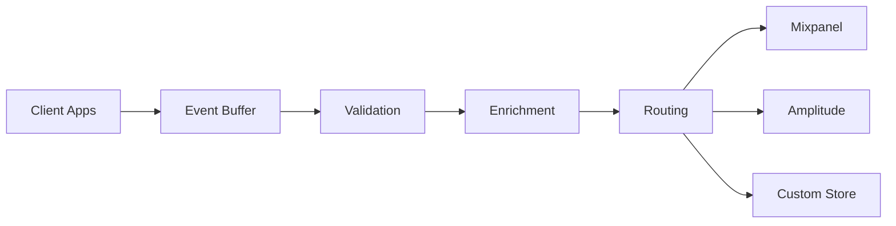

# Analytics & Telemetry Infrastructure

Comprehensive analytics and telemetry system for monitoring Aideon Lite AI performance, user behavior, and system health across all platforms.

## 🎯 Overview

This infrastructure provides:
- **User Analytics** - Behavior tracking and engagement metrics
- **Performance Telemetry** - System performance and error monitoring
- **Business Intelligence** - Usage patterns and revenue analytics
- **Real-time Monitoring** - Live system health and alerts

## 📊 Analytics Providers

### Mixpanel
**Location:** `mixpanel/`  
**Purpose:** User behavior and engagement tracking  

```typescript
import { MixpanelAnalytics } from './mixpanel';

const analytics = new MixpanelAnalytics({
  token: process.env.MIXPANEL_TOKEN,
  environment: process.env.NODE_ENV
});

// Track user events
analytics.track('chat_message_sent', {
  model: 'gpt-4o',
  tokens: 150,
  cost: 0.003,
  user_tier: 'pro'
});

// Track user properties
analytics.identify(userId, {
  subscription_tier: 'pro',
  total_conversations: 45,
  signup_date: '2025-01-15'
});
```

### Amplitude
**Location:** `amplitude/`  
**Purpose:** Product analytics and user journey tracking  

```typescript
import { AmplitudeAnalytics } from './amplitude';

const analytics = new AmplitudeAnalytics({
  apiKey: process.env.AMPLITUDE_API_KEY,
  serverUrl: process.env.AMPLITUDE_SERVER_URL
});

// Track conversion funnel
analytics.track('signup_started', { source: 'landing_page' });
analytics.track('signup_completed', { method: 'email' });
analytics.track('first_chat_sent', { model: 'claude-3-5-sonnet' });
```

### Custom Events
**Location:** `custom-events/`  
**Purpose:** Internal analytics and custom business metrics  

```typescript
import { CustomAnalytics } from './custom-events';

const analytics = new CustomAnalytics({
  endpoint: process.env.ANALYTICS_ENDPOINT,
  batchSize: 100,
  flushInterval: 30000
});

// Track business metrics
analytics.track('revenue_generated', {
  amount: 29.99,
  currency: 'USD',
  subscription_tier: 'pro',
  billing_cycle: 'monthly'
});
```

## 📈 Telemetry System

### OpenTelemetry
**Location:** `telemetry/opentelemetry/`  
**Purpose:** Distributed tracing and observability  

```typescript
import { OpenTelemetryConfig } from './opentelemetry';

const telemetry = new OpenTelemetryConfig({
  serviceName: 'aideon-lite-api',
  serviceVersion: '1.0.0',
  environment: process.env.NODE_ENV,
  exporters: ['jaeger', 'prometheus']
});

// Automatic instrumentation for:
// - HTTP requests
// - Database queries
// - Redis operations
// - External API calls
```

### Custom Metrics
**Location:** `telemetry/custom-metrics/`  
**Purpose:** Application-specific performance metrics  

```typescript
import { MetricsCollector } from './custom-metrics';

const metrics = new MetricsCollector({
  namespace: 'aideon_lite',
  labels: { service: 'api', version: '1.0.0' }
});

// Track custom metrics
metrics.counter('chat_requests_total').inc({ model: 'gpt-4o' });
metrics.histogram('response_time_seconds').observe(0.245);
metrics.gauge('active_users').set(1250);
```

## 🎨 Analytics Dashboard

### Key Metrics Tracked

#### User Engagement
- Daily/Monthly Active Users (DAU/MAU)
- Session duration and frequency
- Feature adoption rates
- User retention cohorts
- Conversion funnel analysis

#### AI Model Usage
- Model selection preferences
- Token consumption patterns
- Cost per conversation
- Response time distributions
- Error rates by model

#### Business Metrics
- Revenue per user (ARPU)
- Customer lifetime value (CLV)
- Churn rate and reasons
- Subscription tier distribution
- Feature usage by tier

#### System Performance
- API response times
- Database query performance
- Error rates and types
- System uptime and availability
- Resource utilization

### Real-time Dashboards

#### Operations Dashboard
```typescript
// Real-time system health
const healthMetrics = {
  uptime: '99.95%',
  responseTime: '245ms',
  errorRate: '0.02%',
  activeUsers: 1250,
  requestsPerSecond: 150
};
```

#### Business Dashboard
```typescript
// Real-time business metrics
const businessMetrics = {
  dailyRevenue: 2450.00,
  newSignups: 45,
  activeSubscriptions: 1200,
  conversionRate: '3.2%',
  churnRate: '1.8%'
};
```

## 🔧 Configuration

### Environment Variables
```env
# Mixpanel
MIXPANEL_TOKEN=your_mixpanel_token
MIXPANEL_EU=false

# Amplitude
AMPLITUDE_API_KEY=your_amplitude_key
AMPLITUDE_SERVER_URL=https://api2.amplitude.com

# Custom Analytics
ANALYTICS_ENDPOINT=https://analytics.aideonlite.com
ANALYTICS_BATCH_SIZE=100
ANALYTICS_FLUSH_INTERVAL=30000

# OpenTelemetry
OTEL_SERVICE_NAME=aideon-lite-api
OTEL_SERVICE_VERSION=1.0.0
OTEL_EXPORTER_JAEGER_ENDPOINT=http://jaeger:14268/api/traces
OTEL_EXPORTER_PROMETHEUS_ENDPOINT=http://prometheus:9090

# Feature Flags
ENABLE_ANALYTICS=true
ENABLE_TELEMETRY=true
ENABLE_ERROR_TRACKING=true
ANALYTICS_SAMPLE_RATE=1.0
```

### Privacy Configuration
```typescript
interface PrivacyConfig {
  enableUserTracking: boolean;
  anonymizeIpAddresses: boolean;
  respectDoNotTrack: boolean;
  dataRetentionDays: number;
  enableGdprCompliance: boolean;
  cookieConsentRequired: boolean;
}
```

## 📊 Data Pipeline

### Event Collection


### Data Processing
1. **Collection** - Events from all platforms
2. **Validation** - Schema validation and sanitization
3. **Enrichment** - Add context and metadata
4. **Routing** - Send to appropriate analytics providers
5. **Storage** - Archive for compliance and analysis

### Real-time Processing
```typescript
// Stream processing for real-time analytics
const eventStream = new EventStream({
  source: 'kafka://analytics-events',
  processors: [
    new ValidationProcessor(),
    new EnrichmentProcessor(),
    new AggregationProcessor(),
    new AlertingProcessor()
  ],
  outputs: [
    'redis://real-time-metrics',
    'websocket://dashboard-updates'
  ]
});
```

## 🚨 Alerting System

### Alert Conditions
- Error rate > 1%
- Response time > 500ms
- User signups drop > 50%
- Revenue drop > 20%
- System uptime < 99.9%

### Alert Channels
- **Slack** - Development team notifications
- **PagerDuty** - Critical system alerts
- **Email** - Business metric alerts
- **SMS** - Emergency notifications

## 🔒 Privacy & Compliance

### GDPR Compliance
- User consent management
- Data anonymization
- Right to be forgotten
- Data export capabilities
- Privacy by design

### Data Security
- Encrypted data transmission
- Secure data storage
- Access control and auditing
- Regular security assessments
- PII detection and masking

## 📈 Reporting

### Automated Reports
- **Daily** - System health and key metrics
- **Weekly** - User engagement and business metrics
- **Monthly** - Comprehensive performance review
- **Quarterly** - Strategic insights and recommendations

### Custom Reports
- Ad-hoc analysis capabilities
- Custom dashboard creation
- Data export functionality
- API access for external tools

## 🛠 Development

### Local Development
```bash
# Start analytics stack
docker-compose -f docker-compose.analytics.yml up

# Run tests
npm run test:analytics

# Validate events
npm run validate:events
```

### Testing
```typescript
// Analytics testing utilities
import { AnalyticsTestHarness } from './testing';

const harness = new AnalyticsTestHarness();

test('tracks user signup event', async () => {
  await harness.track('user_signup', { method: 'email' });
  
  expect(harness.getEvents()).toContainEqual(
    expect.objectContaining({
      event: 'user_signup',
      properties: { method: 'email' }
    })
  );
});
```

## 📞 Support

- **Documentation**: [docs.aideonlite.com/analytics](https://docs.aideonlite.com/analytics)
- **Monitoring**: [status.aideonlite.com](https://status.aideonlite.com)
- **Issues**: [GitHub Issues](https://github.com/AllienNova/ApexAgent/issues)
- **Team**: analytics@aideonlite.com

---

**Data-driven insights for AI-powered growth** 📊

